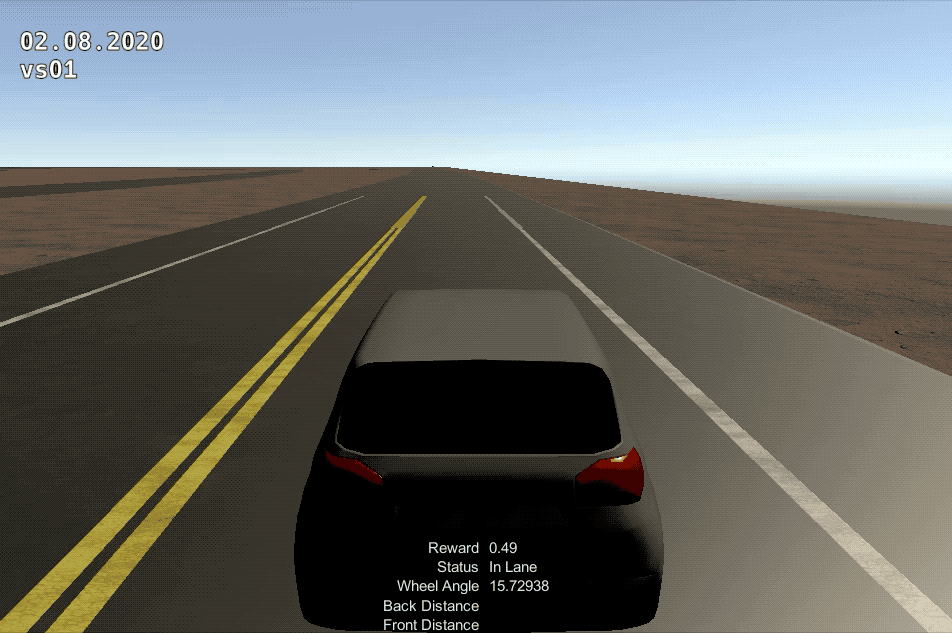
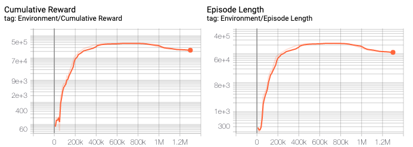

# Autonomous Driving in Unity using ML Agents 
## Advanced Deep Learning Project

* [Development Documentation](docs/README.md)

### Authors
* [Grant Gasser](https://www.linkedin.com/in/grantgasser/)
* [Blaine Rothrock](https://www.linkedin.com/in/brothrock/)

## V1 Results
 
 
 

### Thoughts on V1 and Next Steps
* Lane-keeping is fairly good, want to discretize actions to limit "jerkiness"
* Train on AWS using pre-configured [Deep Learning AMI](https://aws.amazon.com/marketplace/pp/B077GCH38C) 
* Test on different tracks
* Move on to Part 2 (see **Project Plan** towards bottom)

### Unity Environment + ML Agents
* With our self-built driving environment in Unity, we use the ML Agents toolkit to train our car to drive within lanes using reinforcement learning
* [ML Agents repo](https://github.com/Unity-Technologies/ml-agents)
* [ML Agents paper](https://arxiv.org/pdf/1809.02627.pdf)

## Self-Driving Car Research
### Tesla
* Sensors:
Eight surround **cameras** provide 360 degrees of visibility around the car at up to 250 meters of range. Twelve updated **ultrasonic sensors** complement this vision, allowing for detection of both hard and soft objects at nearly twice the distance of the prior system. A forward-facing **radar** with enhanced processing provides additional data about the world on a redundant wavelength that is able to see through heavy rain, fog, dust and even the car ahead. **Sonar devices** (like parking sensors) detect objects in close range.
  - Ultrasonic: usually short distance
  - Radar: like an echo but with radio waves (long wave lengths on electromagnetic spectrum) instead of sound waves
  - [Autonomy pres](https://www.youtube.com/watch?v=HM23sjhtk4Q)
  - Elon Musk says Lidar is too expensive, doesn't provide enough extra benefit
  - Karpathy: Can annotate video using a sensor like radar ("this car you're seeing in front of you in this box is 17m away"), train neural network on that
  - Self-supervised way of learning depth with video: just be consistent in all predictions (no targets)
  - Images/video are much more information rich (lidar can't tell you the difference between plastic bag or tire)
  - Radar can go thru fog, dust, snow, rain, etc. where lidar isn't great; lidar (_light detection and ranging_) uses ultraviolet, visible, or near infrared light to image objects
  - Detection is best outside/away from visual spectrum
  - Elon: high precision GPS maps are a really bad idea
  - Tesla built own full self-driving chip (FSD) specially designed to process images quickly through convolutional neural network
  
### NVIDIA Self-driving software with paper
* Similar to our project
* [Conv Net](https://devblogs.nvidia.com/deep-learning-self-driving-cars/) approach: imitate driver
* Input: Images, Targets: (wheel angle)

## Project Plan
* Part 1: lane keeping with RL agent, after trained, collect images (1-8 cameras) with associated wheel angle and acceleration
* Part 2: Conv Net in TensorFlow, connect to Unity environment with [Python API](https://github.com/Unity-Technologies/ml-agents/blob/master/docs/Python-API.md)
  - Input: Images collected from RL agent and (our driving)
  - Targets: (wheel angle, torque, ...)
* Stretch goal: Use lidar (or radar) and add several RL agents 

