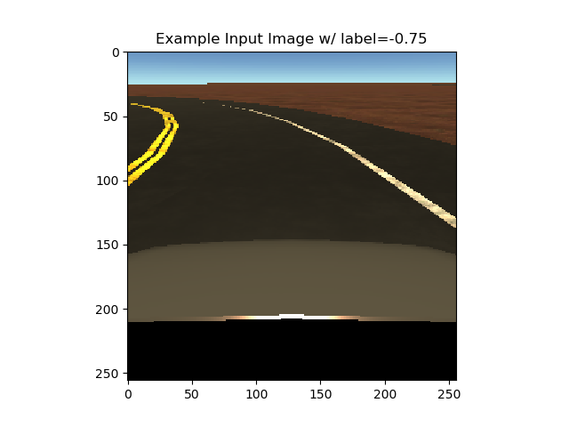
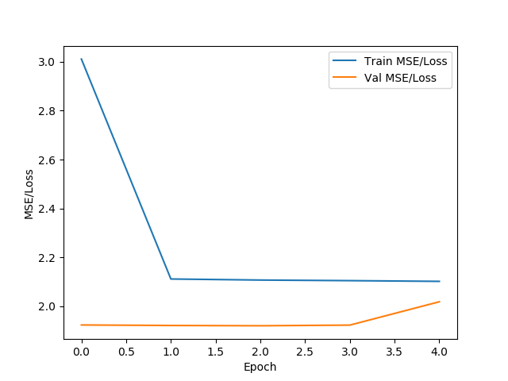

# Part 2 - Convolutional Neural Network
## Summary
Using data generated from our RL agent, we trained a CNN to take an image as input and predict the wheel angle of the vehicle. That way, theoretically, the vehicle could turn to that wheel angle and hopefully drive the track as well as the RL agent. 

## Design
* Adam Optimizer
* Mean Squared Error Loss
* Architecture in TensorFlow 2:
```python
model = models.Sequential()
model.add(layers.Conv2D(x_train.shape[1], (3, 3), activation='relu', input_shape=(x_train.shape[1:])))
model.add(layers.MaxPooling2D((2, 2)))
model.add(layers.Conv2D(64, (3, 3), activation='relu'))
model.add(layers.MaxPooling2D((2, 2)))
model.add(layers.Flatten())
model.add(layers.Dense(64, activation='relu'))
model.add(layers.Dense(1))
```
## Data
[Download and view](https://blainerothrock-public.s3.us-east-2.amazonaws.com/autonomous-vehicle-sim/driving_data_03_01.zip) the data used to train the CNN.

#### Input Example: 
The input data says that the RL agent had the wheels turned at -.75 degrees (a little to the left) which makes sense since the car is in the midst of a left turn.


#### Loss:


We think the validation loss might have been lower due 
to dropout that TensorFlow employs.

## Steps
### Train locally with small dataset (800 images)
Model quickly minimized loss to `<1` after just a couple epochs. 
We were worried that it might be overfitting, so we decided
to generate many more images and use different tracks. 

### Train on AWS with 11,000 images 
* 10X speedup using `p2.xlarge` instance
* Loss dropped from 100 to 2-3 within the first epoch 
and then plateaued at 2.
* Predictions were not satisfactory:
```python
pred: [-0.17952797] y_test 3.25
pred: [-0.09580775] y_test 0.0
pred: [-0.09580775] y_test 1.25
pred: [-0.09574586] y_test 3.75
pred: [-0.09580775] y_test -1.0
pred: [-0.10042676] y_test -5.75
pred: [-0.09580775] y_test 0.0
pred: [-0.10159583] y_test 0.0
pred: [-0.09580775] y_test 0.0
pred: [-0.09580775] y_test -0.25
```

Note how the predictions are all small, negative numbers.
We guess that this model fell into a local minima. Also, 
the targets are all multiples of `.25` - While we could round 
the predictions to the nearest `.25` interval, they would
still be unsatisfactory.

## Further Thoughts
While working on **Part 2** we became skeptical that the CNN would be able to drive
the car because even if the predictions were close, a few incorrect predictions
such may lead the car to a position that would capture an image that is very different
from any image it has ever seen before. For example, if there were several negative predictions in a row
and the car was not on a left turn, then the car would be facing left
of the track and would unlikely be able to correct itself like the RL agent did. This would require
generating image data that simulates those scenarios.

Essentially, the test distribution could be radically different than the training distribution.
