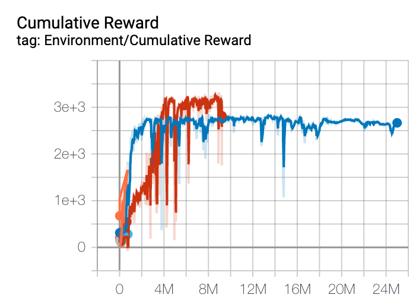
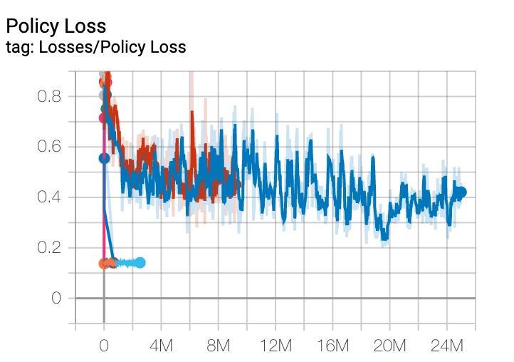

# Reinforcement Training
Our reinforcement learning model is trained using the built in Proximal Policy Optimization from ML-Agents. Our latest hyper parameters can be found in `config/config.yaml` 

## Debugging Environment
We debugged our model to tweak our initial hyper parameters using a smaller testing environment. We moved the start and end boxes to simulate, first, a straight road, then a curve.

## RL Training Run 01
* name: `sv01`
* training command: `mlagents-learn config/sv01_config.yaml --run-id=sv01 --train`
* configuration file: `config/sv01_config.yaml`
* behavioral hyperparameter: 
  * **Steps**: `5 million` force stopped `~1.2 million`
  * **Constant Torque**: `50`
  * **Decision Interval**: `4`
  * **Max Step**: `0` (unlimted)
  * **Reset on Done**: `true`
  * **Vector Observation Space**: `5`
  * **Vector Action Space**: `1`
  * **Number of Concurrent Agents**: `12`
* Machine Details:
  * Ran From Unity
  * GTX 1080
  * Locally (personal desktop Ubuntu 18.4)

### Results
* **Summary Directory**: `rl-training/summaries/vs01_VehicleBrain`
* **NN File**: `rl-training/models/vs01-0/vs01-VehicleBrain.nn`

 
 
 

### Findings
The vehicle generally learned the track converging at about 500K steps. At about 900K the model started to decrease in reward and episode length. While the vehicle was able to stay in the lane, we do not believe this is a good model to generate data from. The largest problem is the continuous action. The action is given in the form of a -1, 1 value which is then translated to a -30, 30 scale for the wheel angle. This is a infinite space that vastly under values the action to continue with the current angle. If you watch the video, the car is jerky and the wheel angle changes drastically from step to step. Ideally we would want a smooth angle transition. In some cases we can see the wheel angles toggling from -30 to 30, which is not realistic. In the simulation the time between steps does not allow for the wheel to turn it's entire degree range and therefor results in a jerky straight line.  

### Next Steps
Redesign the action to be a classification with the following classes:
* positive wheel angle delta
* negative wheel angle delta
* constant wheel angle

This will only allow the wheels to move *k* degree(s) in one direction in a step and have a even representation for no change in direction. Hyperparameters such as decision interval and the vector observation space will need to be adjusted. May consider a small reward for keeping the direction constant.

## RL Training Run 02 (Discrete Reward)
* name: `vs02`
* training command: `mlagents-learn config/vs02_config.yaml --run-id=sv01 --train`
* configuration file: `config/vs02_config.yaml`
* behavioral hyperparameter: 
  * **Steps**: `25 million`
  * **Constant Torque**: `50`
  * **Decision Interval**: `1`
  * **Max Step**: `20000`
  * **Reset on Done**: `true`
  * **Vector Observation Space**: `5`
  * **Vector Action Space**: `1`
  * **Number of Concurrent Agents**: `12`
* Machine Details:
  * Ran From Unity
  * GTX 1080
  * Locally (personal desktop Ubuntu 18.4)

### Updates
Main change was switching to a discrete reward system that greatly limited the amount of wheel angle change from step-to-step. see [vehicle agent](vehicle_agent.md)
doc for more details. 

 
 
  

### Findings
The control of the vehicle was much smoother when switching to a discrete reward system, but the training was much slower. The model ran for 25 million steps, but never learned past ~4 million. We believe this is because of the torque and speed increase over time. After the first curve, the model would loose control of teh vehicle and not be able to pass the next curve. 

## Next step
Update the agent to have a max speed and keep it constant for the entire run.

## RL Training Run 03 (Discrete Reward)
* name: `vs02`
* training command: `mlagents-learn config/vs03_config.yaml --run-id=sv01 --train`
* configuration file: `config/vs03_config.yaml`
* behavioral hyperparameter: 
  * **Steps**: `25 million` extended to `~35 million`
  * **Constant Torque**: `300` But limited RPM
  * **Decision Interval**: `1`
  * **Max Step**: `120000`
  * **Reset on Done**: `true`
  * **Vector Observation Space**: `5`
  * **Vector Action Space**: `1`
  * **Number of Concurrent Agents**: `12`
* Machine Details:
  * Ran From Unity
  * GTX 1080
  * Locally (personal desktop Ubuntu 18.4)

## Updates
Introduced the build recurrent model (LSTM) and add a mechanism to limit the speed based on the wheel's RPM.

   
**TODO**: add latest training images

**TODO**: add video of new track generalization

### Findings
Although the training results had a lot of variance, this model resulted in a usable generalized model for collecting our CNN data. We were able to build road environments with different road configurations and the model would perform lane keeping. 